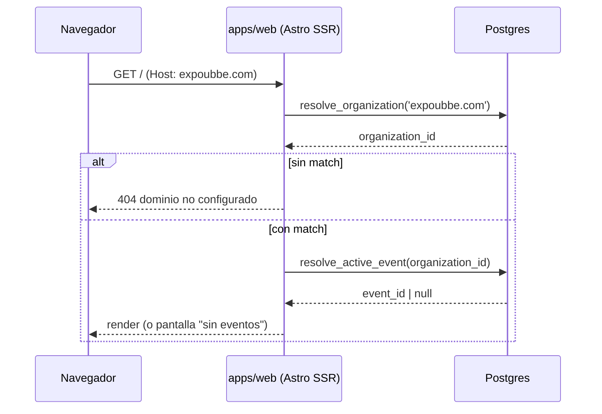
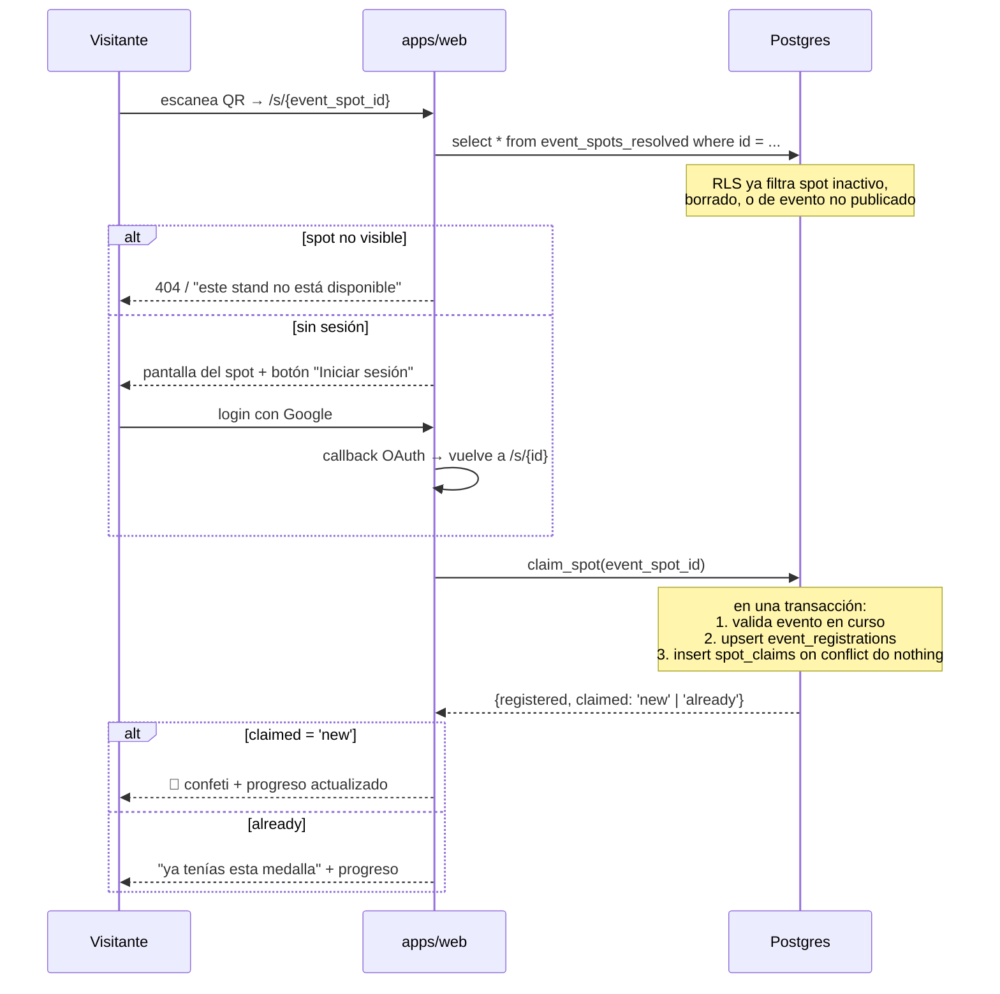
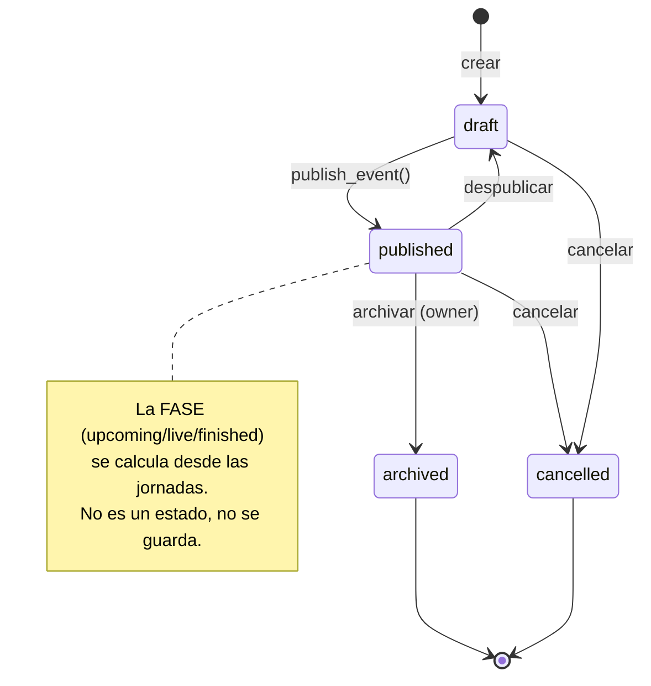
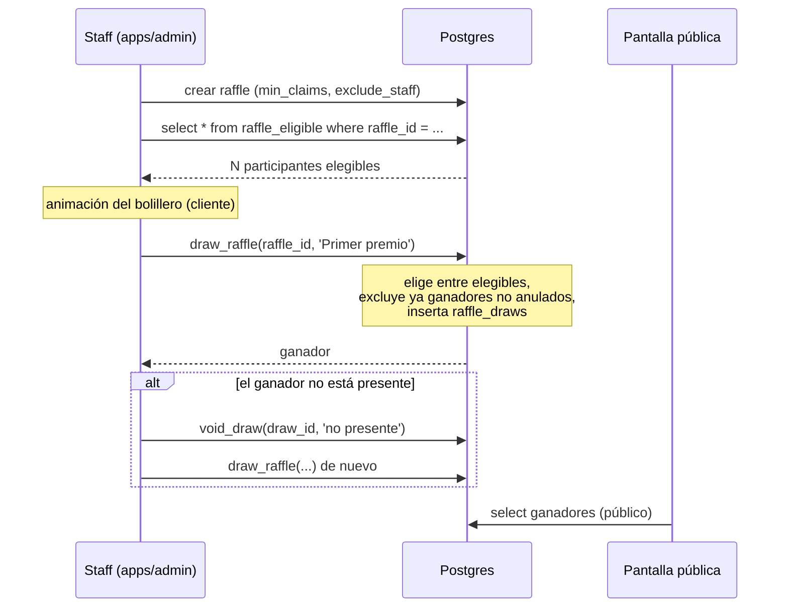

# 05 — Flujos

Los circuitos completos del producto, de punta a punta.

## Resolución del dominio → organización

Reemplaza `EVENTDEX_ORGANIZATION_ID`. Un solo deployment sirve a todos los clientes.



En desarrollo, `PUBLIC_DEV_HOST` fuerza el hostname para no tocar `/etc/hosts`.
El resultado se cachea por request (y con `Cache-Control` en el edge: el mapeo
host→org cambia una vez cada nunca).

## Resolución del evento activo

Lo que pediste: *"debe determinar por sus estados y por sus horarios cuál es el
evento más próximo, o actual, y si no hay ninguno mostrar el último finalizado"*.

En v1 esto es `pickActiveEvent()` en JavaScript: se traen **todos** los eventos
publicados de la organización con sus jornadas embebidas y se ordenan en memoria.
En v2 es una función SQL que devuelve un `uuid`.

```
Candidatos: status = 'published'
          ∧ visibility = 'public'
          ∧ deleted_at IS NULL
          ∧ tiene al menos una jornada        ← sin fechas no se ubica en el tiempo

1. EN CURSO    starts_at <= now() <= ends_at     → el que arrancó primero
2. PRÓXIMO     starts_at > now()                 → el de arranque más cercano
3. TERMINADO   ends_at < now()                   → el que terminó último
```

El rango del evento es de la **primera jornada al fin de la última**, no jornada
por jornada: un evento de sábado y domingo no debe figurar como terminado el
sábado a la noche. Esa regla ya estaba bien en v1 (`eventRange`) y se conserva tal
cual, solo que ahora vive en la vista `event_timeline`.

```sql
create or replace function public.resolve_active_event(p_organization_id uuid)
returns uuid language sql stable as $$
  select t.event_id
  from public.event_timeline t
  join public.events e on e.id = t.event_id
  where e.organization_id = p_organization_id
    and e.status = 'published'
    and e.visibility = 'public'
    and e.deleted_at is null
  order by
    case
      when now() between t.starts_at and t.ends_at then 0   -- en curso
      when t.starts_at > now()                      then 1   -- próximo
      else                                                2  -- terminado
    end,
    case when t.starts_at > now() then t.starts_at end asc nulls last,
    case when t.ends_at   < now() then t.ends_at   end desc nulls last,
    t.starts_at asc
  limit 1;
$$;
```

Un solo `ORDER BY` con las tres reglas en prioridad. Devuelve `null` solo si la
organización no tiene ningún evento publicado con fechas.

## Reclamo de medalla (el circuito principal)



Diferencias con v1:

| v1 | v2 |
|----|-----|
| `collectMedal` hace SELECT y después INSERT; la carrera la cierra el índice único | Una sola función, un `insert ... on conflict do nothing returning` |
| El registro es implícito | `claim_spot` crea el `event_registrations` si falta, en la misma transacción |
| Cada query repite `.is("deleted_at", null)` | RLS lo hace invisible |
| El INSERT ocurría durante el render de la página | Acción explícita, nunca en el render |

Regla de negocio: **solo se puede reclamar con el evento en curso.** En v1 no se
valida — un QR sacado con foto se puede reclamar dos días antes. `claim_spot`
consulta `event_timeline` y rechaza si la fase no es `live`. Configurable por
evento vía `settings.claim_window` si alguna organización quiere permitir el
reclamo anticipado.

## Ciclo de vida de un evento



### `publish_event(event_id)`

Publicar no es un `UPDATE status`. Valida y congela:

1. **Valida**: tiene al menos una jornada, tiene sede o está marcado como online,
   tiene al menos un spot activo, tiene título y descripción.
2. **Congela** `event_spots.snapshot` con el nombre, descripción y avatar
   actuales de cada spot del catálogo.
3. Marca `status = 'published'` y `published_at = now()`.
4. Escribe en `audit_logs`.

El paso 2 es el que hace que renombrar un spot del catálogo en 2027 no reescriba
la historia de la Expo 2026. Ver [03 — Copia vs. referencia](./03-modelo-de-datos.md#copia-vs-referencia-la-resolución).

### Republicar como nueva edición

Lo que pediste: *"la posibilidad de republicar un evento con una edición distinta"*.

```
duplicate_event(source_event_id, {
  edition_label: '2027',
  edition_number: 2,
  schedules: [...],       -- las fechas nuevas, obligatorias
  copy_spots: true,       -- default
  copy_members: true
})
```

Qué copia y qué no:

| Se copia | No se copia |
|----------|-------------|
| Serie, sede, título, descripción, tema | Jornadas (siempre nuevas) |
| Spots del evento: `spot_id`, `code`, `booth`, `points`, `sort_order` | Snapshots (se congelan al publicar la nueva) |
| Miembros del evento (opcional) | Registros, reclamos, sorteos |
| Configuración (`settings`) | `published_at` — la nueva nace en `draft` |

El evento nuevo apunta a los **mismos** `spots` del catálogo, no a copias. Esa es
toda la ventaja de haber sacado el spot de adentro del evento: en la v1, republicar
significaba recargar los 80 stands a mano.

## Alta de spots

```
┌─ Catálogo (organización) ────────────┐
│  spots                               │  ← existen sin evento
│  · Café Ubbe        (stand)          │
│  · Laberinto        (attraction)     │
│  · Sponsor X        (sponsor)        │
└──────────────────────────────────────┘
            │  se agregan a
            ▼
┌─ Expo 2026 ──────────┐   ┌─ Expo 2027 ──────────┐
│  event_spots         │   │  event_spots         │
│  · Café Ubbe  A12 ✅ │   │  · Café Ubbe  B03 ✅ │
│  · Laberinto  C07 ⛔ │   │  · Sponsor X  A01 ✅ │
└──────────────────────┘   └──────────────────────┘
     estado, código, booth, puntos y overrides
     son de la RELACIÓN, no del spot
```

Desde la interfaz hay dos caminos, y los dos terminan igual:

- **"Agregar del catálogo"** → elegís spots existentes → se crean `event_spots`.
- **"Crear spot nuevo"** → el formulario crea el `spots` **y** el `event_spots` en
  la misma transacción. Para el usuario es un paso; para el modelo, el spot queda
  en el catálogo y sirve para la próxima edición sin que haya tenido que pensarlo.

No existe un spot que viva solo dentro de un evento. Esa uniformidad es lo que
hace que la reutilización funcione sin casos especiales.

## Sorteo



Cambios respecto de v1:

- **El ganador lo elige la base**, no el navegador. En v1 el sorteo se resuelve en
  el cliente y después se persiste el resultado — o sea que el resultado depende de
  código que el organizador podría manipular. `draw_raffle()` lo hace server-side y
  la animación pasa a ser solo animación.
- **Se puede anular una extracción** y volver a sortear. Es lo que pasa siempre en
  la práctica y en v1 no estaba contemplado.
- **Varios premios** por evento.
- La vista `raffle_eligible` centraliza la exclusión del staff (ver
  [02](./02-roles-y-permisos.md#exclusión-del-sorteo)), que en v1 estaba repartida
  entre `getOrganizerUserIds()` y filtros en el cliente.

**Ubicación: `/raffle` se muda de `apps/web` a `apps/admin`.** Es una herramienta
de organizador, y sacarla de la app pública deja a Astro manejando solo sesión de
visitante. Ver [01 — el tradeoff](./01-arquitectura.md#el-tradeoff-que-hay-que-tener-presente).

## Facturación (rol developer)

```
1. Se cierra un evento con una organización
2. Developer crea un event_invoice (concepto, monto, vencimiento)
3. El owner de la org lo ve en su panel (solo lectura)
4. Se paga por fuera de la plataforma (transferencia, factura)
5. Developer marca paid → paid_at, marked_by
6. Queda en audit_logs
```

Sin integración de pagos: es un registro contable manual, que es lo que pediste
("poder ver los pagos o marcar como pagado"). Si más adelante entra Mercado Pago o
Stripe, `event_invoices` ya tiene la forma correcta para colgarle un
`payment_provider_id`.

## Auth

Un solo flujo de OAuth, alojado en `apps/web`:

```
apps/web/auth/callback?next=<url>
```

- Login de visitante: `next` vuelve al spot o al perfil.
- Login de organizador: `apps/admin` redirige a `apps/web/auth/callback` con
  `next` apuntando al dashboard.

Así hay **una sola URL de callback registrada en Google**, y `apps/admin` no
duplica la configuración del proveedor. El intercambio de código por sesión ocurre
en el runtime de Astro; la cookie se escribe en el dominio compartido.

⚠️ Requiere que `apps/web` y `apps/admin` compartan dominio padre
(`expoubbe.com` / `admin.eventdex.com` no lo cumplen). **Decisión pendiente**: o
el admin vive en un subdominio del mismo padre, o cada app tiene su propio callback
(dos URLs en la consola de Google, misma sesión de Supabase). La segunda opción es
más simple de operar y es la recomendada si el admin va a estar en
`admin.eventdex.com`.
