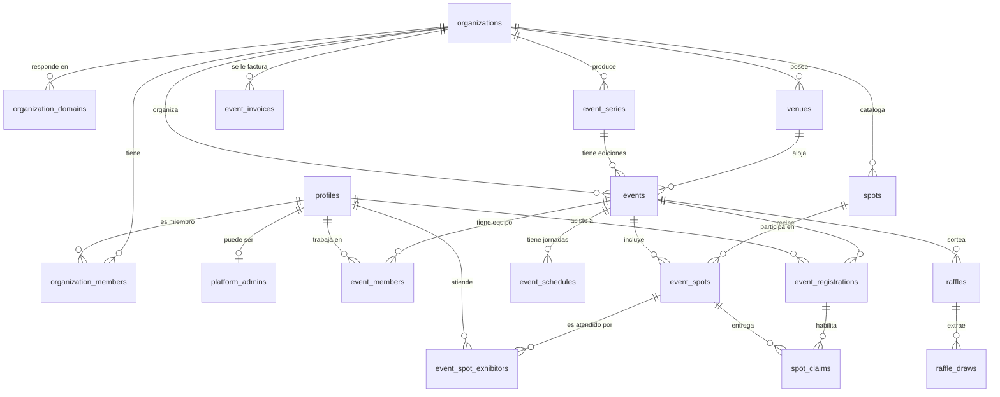
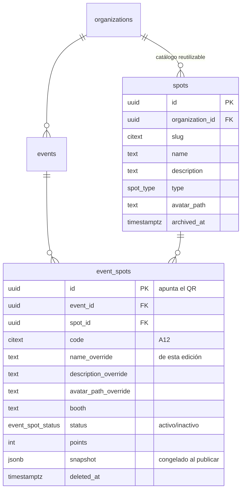
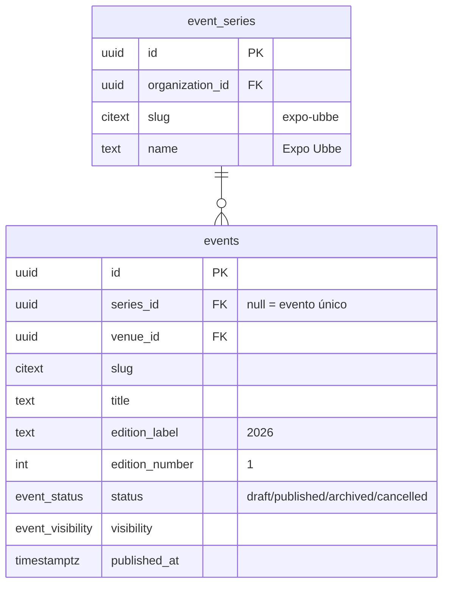
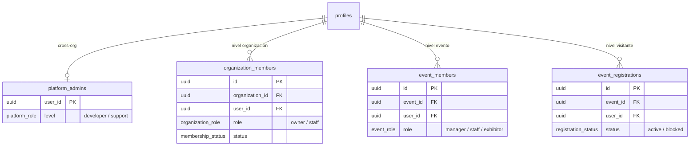
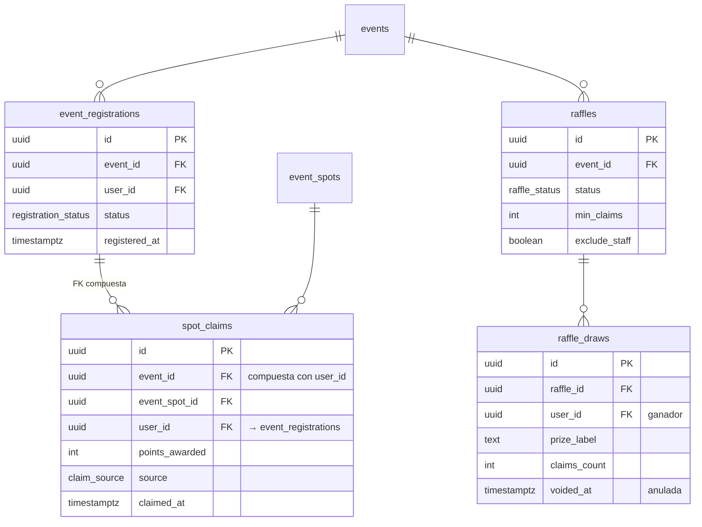

# Diagrama entidad-relación

## Vista general

## El cambio central: spots fuera del evento

`spots` es el catálogo de la organización. `event_spots` es la relación, y lleva
todo lo que es propio de *esa* edición: el código del QR, el puesto, si está
activo, y los overrides. Ver
[03 — Copia vs. referencia](./03-modelo-de-datos.md#copia-vs-referencia-la-resolución).

## Series y ediciones

## Roles: los tres niveles

## Participación

La FK compuesta `spot_claims (event_id, user_id) → event_registrations (event_id, user_id)`
es la que garantiza, **en la base**, que nadie reclame una medalla de un evento al
que no está registrado.
